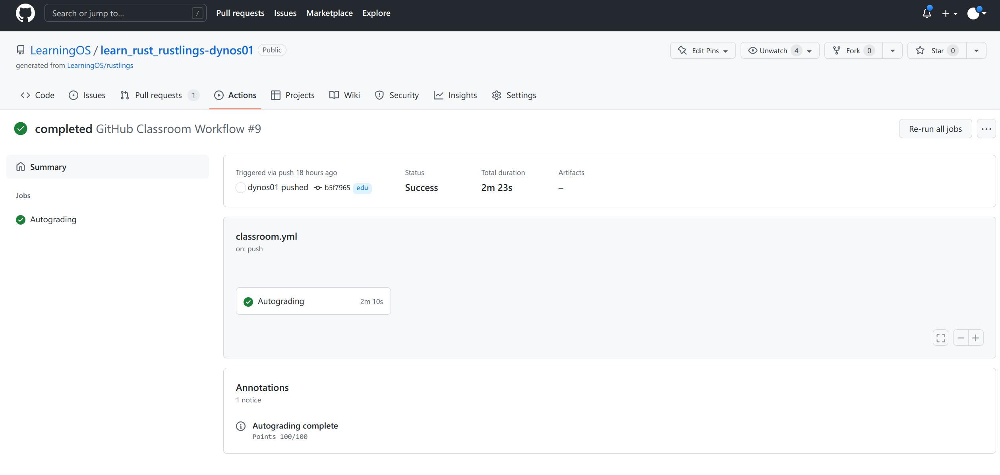

# Day 3

### 本日进度

Rustlings 完结撒花！

### 对次日的期待
- 开始完成 Rust 填空题
- 阅读 RISC-V 要点

### 仍需补足的地方
尽管 Rustlings 已经做完，但仍能感到 Rust 与传统的几门编程语言相比在理念和设计上存在较大创新。例如，Rust 的错误处理机制让人眼前一亮，但对 C++ 用户来说并不容易完全掌握。接下来还要继续阅读 Rust 文档，尽量跳出用旧思路写 Rust 的圈子，尝试使用 Rust 的思维方式来解决问题。
